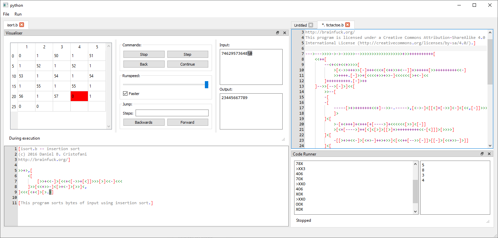
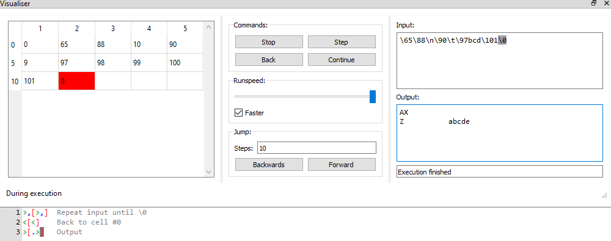

# Esolang-Interpreter-IDE

## Overview
IDE for Esoteric Programming Languages that can also visualise and execute code.

The text editor is build on the Scintilla framework and has features such as multi-cursor support, automatic indentation and syntax highlighting.

Currently, the only language supported is Brainfusk.

Please see [How to use](#how-to-use) for more information.

**Please Note:** The project is early in development and there are bugs. If you are using it to edit your own code, I would highly recommend saving often, as the IDE may break unexpectedly, and your work could be lost.

## How To Install
- Please install the latest Python 3.9 version (PyQt5 does not yet work with Python 3.10): https://www.python.org/downloads/
- Download the project from Github and extract the zip file to a folder, or clone the repository using git.
- Create a virtual environment by using `python -m venv venv` in the root directory of the project.
- Activate the virtual environment `. venv/bin/activate` (Linux) or `./venv/Scripts/activate` (Win)
- Install the project as module to the venv `pip install -e .`
- Install the dependencies `pip install -r .\requirements.txt`
- Now you can run the main file `.\esolang_IDE\__main__.py`

## How To Use

**Note:** The only supported language currently is Brainfusk.

### Editor

The IDE opens with a blank editor.

You can create a new file or open a saved file from the `File` tab, or by using the `Ctrl + N` or `Ctrl + O` shortcut respectively. Files can be saved from the `File` tab or by the `Ctrl + S` shortcut.

The editor supports syntax highlighting, and the colours can be customized from the [lexers.py](esolang_IDE/lexers.py) file.

### Visualiser
Open the visualiser from the `Run` tab or by the `Ctrl + Shift + B` shortcut.

You can step though the code manually, which processes one command at a time; or you can run through the code, which processes commands at regular intervals. The runspeed can be changed using the slider. When running, the visualiser will be updated at the end of every command, or if the faster checkbox is ticked, the visuliser will process multiple commands before updating the display. Running can be paused.

You can also step backwards. There is a history of 1 million commands, so you cannot go more than 1 millions commands backwards.

You can also jump forwards or backwards by specifying the number of steps to jump in the box. The display will be updated after all the commands are completed.

Note, the fastest way to execute code in the visualier is by jumping. However, please be careful not to jump a very large number of steps (> 10 million) at once as this may take a long time, and there is currently no way to interrupt jumping. You should still be able to save your work, and close and reopen the IDE if this happens.

Code editing is blocked during visualisation. If you want to edit the code, you must stop the visualiser, even if it is not currently running. (You can leave the visualiser tab open though.)

See [Input](#input) for more information on how to best configure the input.

The input is not finalized, and can be changed during runtime. The previous accepted input character is highlighted in grey. Anything after the highlighted character can be changed during visualizaion. If you want to change any input before the highlighted character, you can use the visualiser commands to jump or step backwards until you get before the character you want to change.

### Code Runner

The code runner can be opened from the `Run` tab or by the `Ctrl + B` shortcut.

Your code can also be run using the code runner. This makes use of some optimizations and is much faster than the visualiser for execution. However, you cannot pause or go backwards, and cannot visualise any intermediate state.

The output is displayed on the left hand side, and the input is on the right.

If the code runner is waiting for input, running the code runner will make it continue from that point on, rather than restarting it.

See [Input](#input) for more information on how to best configure the input.

Execution can be stopped by using the `Ctrl + C` shortcut. However you need to make sure that the output of the code runner has the current focus (by clicking on it for example). **Please note:** There is currently a bug where the code runner cannot be stopped if it is waiting for input.

### Input
The input can be given as ascii text. You can also use backslash `\` to escape characters. `\n`, `\r`, `\t` represent Line feed (10), Carrage return (13), Horizontal tab (9) respectively.

The input can also be given as a raw value escaped with a backslash. For example, the input `A` can also be given as `\65`.

Here is some example input and its corresponding values and output:

If the input of your program can be of variable length, you can use \0 to terminate the input (which will input an ascii value of 0).